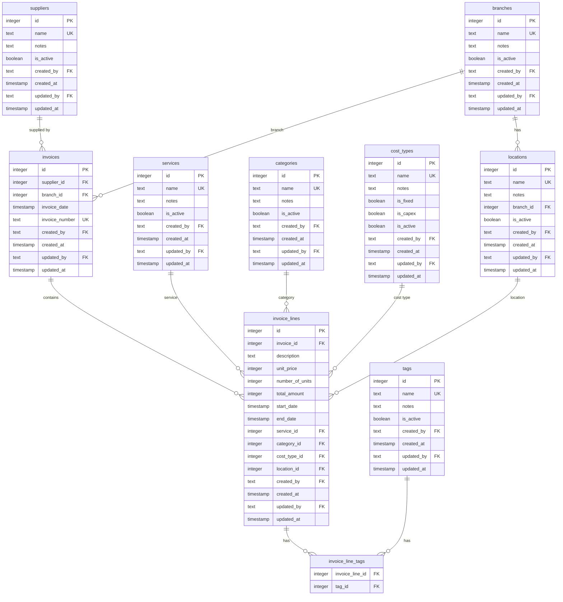
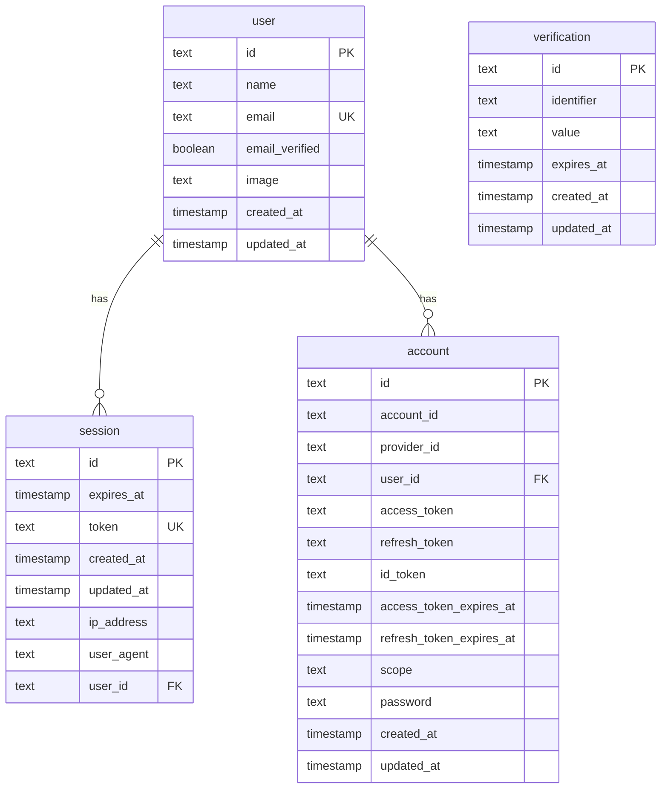

# Database ERD

## Application Tables

> **Note:** All tables have `created_by` and `updated_by` foreign keys referencing the `user` table (see [BetterAuth Tables](#betterauth-tables)). These relationships are omitted from the diagram above for clarity.

## BetterAuth Tables

